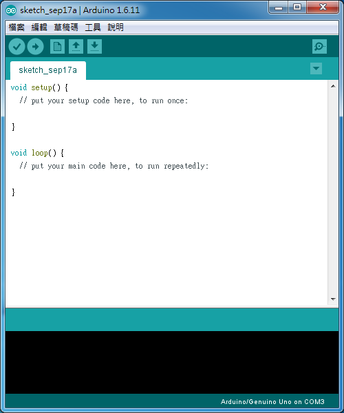
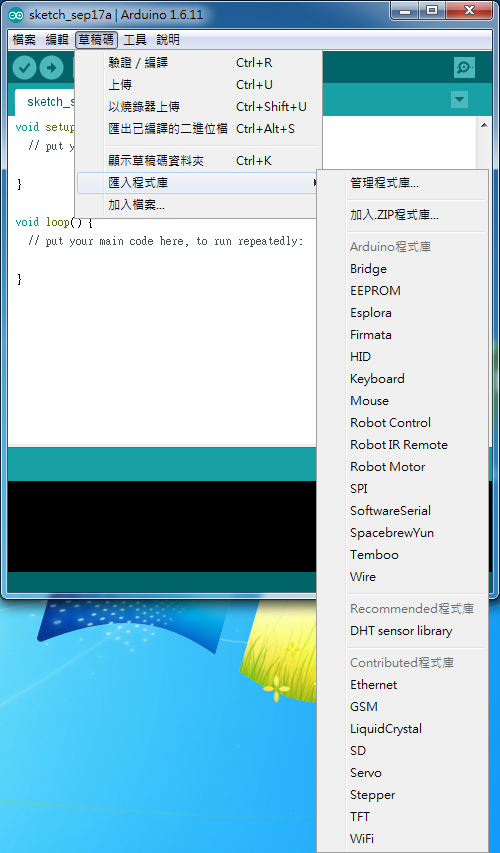
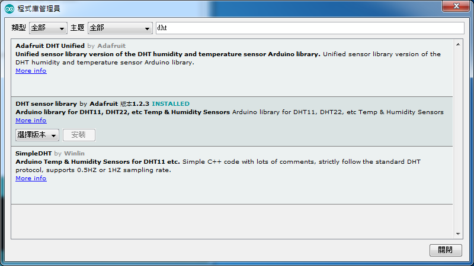
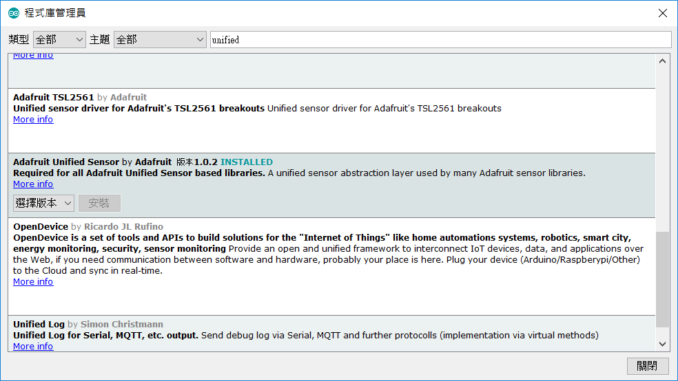
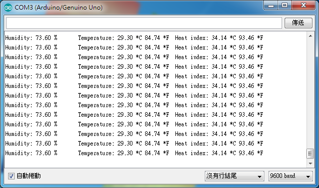

如標題所說，DHT22 是一個可以測量溫度及濕度的感測器。雖然精準度比 DHT11 好，不過價格也比 DHT11 還要高的多，為了使測量能夠更加精確，所以這次採用 DHT22 感測器。而且模組化使得安裝能夠更簡單，不需要自己加上電阻，也不需要自己焊接電子零件，因此 DHT22 感測模組相較之下是更好的選擇。

[[info | DHT11 與 DHT22 的比較]]
|
| | | DHT11 | DHT22 |
| | :----------| :----------| :----------|
| | 溼度範圍 | 20-80% | 0-100% |
| | 溼度精確度 | 5% | 2-5% |
| | 溫度範圍 | 0 ~ 50°C | -40 ~ 80°C |
| | 溫度精確度 | ±2°C | ±0.5°C |
| | 取樣頻率 | 1 Hz | 0.5 Hz |
| | 官網價格 | 5 美金 | 9.95 美金 |
|
| 資料來源：[https://learn.adafruit.com/dht](https://learn.adafruit.com/dht)

在一切開始之前，先確認以下材料是否都齊全了：

+----------------------+-------------------------------------------+
| Arduino Uno          | 1塊                                       |
+----------------------+-------------------------------------------+
| DHT22 溫溼度感測模組 | 若干塊                                    |
+----------------------+-------------------------------------------+
| 麵包版               | 1塊                                       |
+----------------------+-------------------------------------------+
| 杜邦線               | 當 DHT22 數量＝1 時：3 條<br>             |
|                      | 當 DHT22 數量＞1時：( DHT22 數量\*3+2) 條 |
+----------------------+-------------------------------------------+

首先，要去 [Arduino 的官網](https://www.arduino.cc/)下載 IDE，打開會像以下這樣。



將 Arduino Uno 經過 USB 線接到電腦後，點工具＞序列埠選擇你已連接的裝置。

再來要匯入程式庫。

## 匯入程式庫

在 Arduino IDE 中，不一定要另外上網搜尋程式庫並下載匯入。它可以藉由程式庫管理員進行搜尋、下載和匯入，完全不用離開 IDE。

比如說，你可以點選草稿碼＞匯入程式庫＞管理程式庫...



等程式庫資訊更新完成後，搜尋 dht22，找到 DHT sensor library：



點 More info 可進入 github repository，點安裝即可安裝。

[[warning]]
| 當時使用的版本為 1.2.3

可以使用 [這邊的版本 1.2.3 的範例程式碼](https://github.com/adafruit/DHT-sensor-library/blob/1.2.3/examples/DHTtester/DHTtester.ino)。

## 使用最新版本

當時最新版本還在 1.3.0 時提到 1.2.3 與 1.3.0 間對程式碼的修改只有[這個 commit](https://github.com/adafruit/DHT-sensor-library/commit/c97897771807613d456b318236e18a04b013410b)，看起來只是為了整合 [Adafruit Unified Seneor](https://github.com/adafruit/Adafruit_Sensor) 而更新，原始碼並沒有改變。

然而在 2019 年，這個程式庫重新變得活躍，帶來了更多更新，因此建議使用最新版。

從版本 1.3.0 起，就必須多安裝 [Adafruit Unified Seneor](https://github.com/adafruit/Adafruit_Sensor) 這個 library。

Adafruit Unified Seneor 也能在 Arduino IDE 的程式庫管理員中安裝。



[[warning]]
| 這也是舊圖，目前版本為 1.0.3

安裝完後可以看看[範例程式碼](https://github.com/adafruit/DHT-sensor-library/blob/master/examples/DHTtester/DHTtester.ino)。

## 硬體

再來進行硬體的配線。

DHT22 模組內有 3 個 port，依序標示＋、out 及－。

* ＋要接到 5v 接腳
* out 要接到某個資料 port  （建議從第 3 個 port 開始）
* －要接到 GND 接腳

## 上傳程式

接完之後就來把剛剛的範例程式上傳到 Arduino 吧。

在範例程式的第 10 行（版本 1.2.3 為第 6 行）：

```c
#define DHTPIN 2 // what digital pin we're connected to
```

參數要改為你剛剛資料線接到的那個資料 port 編號

改完後點草稿碼＞驗證/編譯 & 上傳，程式碼就上傳到 Arduino 了。開啟工具＞序列埠監控視窗看看執行結果吧。


